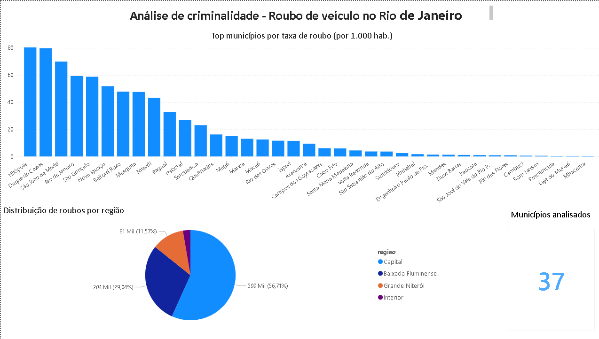

# 🔍 Análise de Criminalidade no Estado do Rio de Janeiro

Análise exploratória da taxa de roubo de veículos por 1.000 habitantes nos municípios do Estado do Rio de Janeiro, utilizando dados públicos e Python.

---

## 📌 Objetivo

Identificar padrões e municípios com maior incidência de roubo de veículos no RJ, gerando visualizações que apoiem a compreensão do cenário de segurança pública no estado.

---

## 📊 Resultado — Análise em Python


## 📊 Dashboard Power BI



---

## 🛠️ Tecnologias utilizadas

- Python
- Pandas
- Matplotlib
- Jupyter Notebook
- Power BI

---

## 📁 Estrutura do projeto

```
Analise_criminalidade_rj/
├── Projto_Analise_Dados/        # Notebook com a análise completa
├── saida.png                    # Gráfico gerado pela análise Python
├── dashboard_power_bi.png       # Dashboard gerado no Power BI
├── Analise-criminalidade-rj.pbix # Arquivo Power BI (download disponível)
└── README.md
```

---

## 🗂️ Fonte dos dados

Dados públicos de segurança do Estado do Rio de Janeiro — [Instituto de Segurança Pública (ISP-RJ)](http://www.ispdados.rj.gov.br/)

---

## ▶️ Como executar

1. Clone o repositório:
```bash
git clone https://github.com/is4beell/Analise_criminalidade_rj.git
```

2. Instale as dependências:
```bash
pip install pandas matplotlib jupyter
```

3. Abra o notebook:
```bash
jupyter notebook
```

---

## 👩‍💻 Autora

**Isabel Miranda**  
Cursando Gestão da Tecnologia da Informação | Formação em Análise de Dados (Senac RJ)  
[](https://www.linkedin.com/in/isabel-miranda-licitações-tecnologia)
